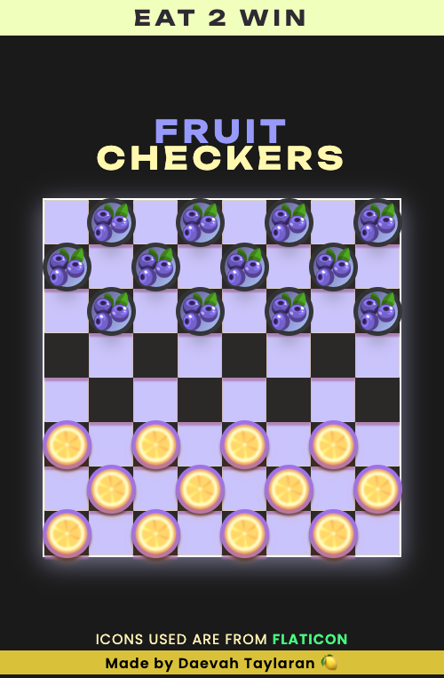
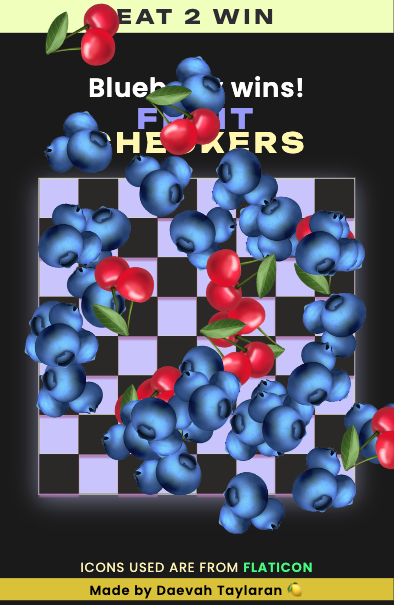
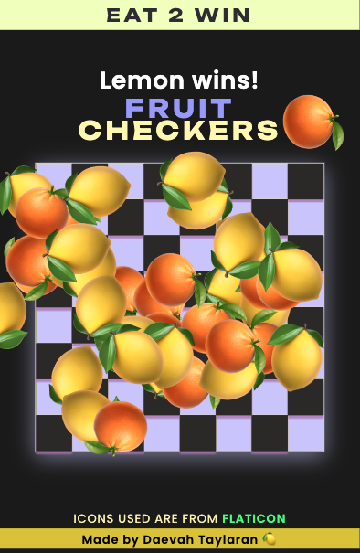

## (FRUIT) CHECKERS 
___

#### GAME DESCRIPTION

A browser mini game of checkers using fruit themed checker pieces. 

- ###### GAMEPLAY
Players move a checker piece each turn, with the objective of capturing all the opponent's pieces.
- ###### MOVEMENT
  - Normal pieces can only move <i>forward</i> diagonally or anti-diagonally.
  - Pieces need to jump over an opponent's piece once encountered
###### DETERMINING RESULTS
- ###### WINNER
  - First player to capture all opponent pieces
  - In this browser game, the mode is set to easy where you just have to capture two of the opponent's pieces!

___
##### SCREENSHOTS:

##### (SOME) FUTURE APP FEATURES:
- As a player, having an option for a 2 player game or a game against a computer would be fun, because it give a more well-rounded gameplay experience.
- As a player, I would appreciate a day/night mode button toggle because it would be beneficial to prevent some eye strain.

___

##### TECHNOLOGIES USED:
- HTML5
- CSS
- JavaScript
- NPM (Node Package Manager) via CDN for emoji confetti
___

##### GETTING STARTED:

Fruit Checkers is deployed on GitHub Pages:
<a href="https://dmt94.github.io/checkers/">GAME LINK</a>

###### Architecture and Challenges

- ###### Classes  
  - A majority of the code is written using classes, taking advantage of encapsulation.
    - Personally, it was easier to follow the flow of the game when the variables involved are encapsulated into specific methods belonging to classes
- ###### Bugs
  - Fixing bugs took a majority of the project time. It was challenging to reproduce a particular bug in my game where a glitch would occur if another checker piece was clicked during a player's turn.  

___

##### FUTURE IMPROVEMENTS:

- As a player, having an option for a 2 player game or a game against a computer would be fun, because it give a more well-rounded gameplay experience.

- A day/night mode button toggle because it would be beneficial to me if I experience eye strain.

- Be able to pick different pieces on the main menu would be a fun addition

